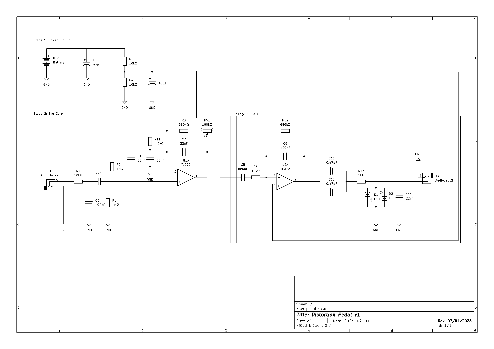

# Under Pressure - Circuit Design

## Overview

This is a minimal-parts-count analog distortion circuit based on Brian Wampler's design. The circuit is designed to be built on a breadboard for testing before PCB construction.

**Note**: This simplified version **excludes the passive tone control stage** for minimal component count. It includes only power supply, two gain stages with clipping, and an output buffer.

## Circuit Architecture

The circuit consists of three main stages: the **Power Supply** stage provides DC power to all circuit components, the **Distortion Core** implements two gain stages with clipping diodes to shape the distortion character, and the **Output Buffer** provides final amplification with impedance buffering for clean output.

The intersection in all three stages is **vref** in the original schematic.

## Component List

### Breadboard Phase
| Component | Value | Qty |
|-----------|-------|-----|
| **OPERATIONAL AMPLIFIERS** | | |
| TL072 Operational Amplifier | - | 2 |
| **CAPACITORS** | | |
| Radial Electrolytic Capacitor | 47µF | 2 |
| Ceramic Disc Capacitor | 100pF | 2 |
| Ceramic Disc Capacitor | 22nF | 4 | 
| Ceramic Disc Capacitor | 47pF | 1 | 
| X7R Multilayer Ceramic Capacitor | 680nF | 1 | 
| Tantalum Electrolytic Capacitor | 0.47µF | 2 | 
| **RESISTORS AND POTENTIOMETERS** | | |
| Carbon Film Resistor 1/4W | 10KΩ | 1 | 
| Carbon Film Resistor 1/4W | 1KΩ | 1 | 
| Carbon Film Resistor 1/2W | 1MΩ | 1 | 
| Carbon Film Resistor 1/2W | 2.2KΩ | 1 | 
| Carbon Film Resistor 1/2W | 4.7KΩ | 1 | 
| Carbon Film Resistor 1/2W | 680KΩ | 1 |
| Potentiometer | 100KΩ Linear | 1 |
| **POWER SUPPLY** | | |
| Panasonic 9V Alkaline Battery | - | 1 |
| 9V Battery Holder with Wire | - | 1 | 
| **INPUT/OUTPUT** | | |
| 5mm Red Diffuse LED | - | 2 |
| Female Jack Connector | - | 2 | 

### PCB Phase
It is hardly recommended in terms of space to use PCB components, but in order to mantain simplicity i'm going to use the same components of the breadboard phase. Please keep this in mind if you use the KiCad archive or if you print the PCB.

## Modifications from Wampler's Original
1. This version excludes stage IV for simplicity.
2. Small changes in capacitors due to the lack of capacitors when buyed
