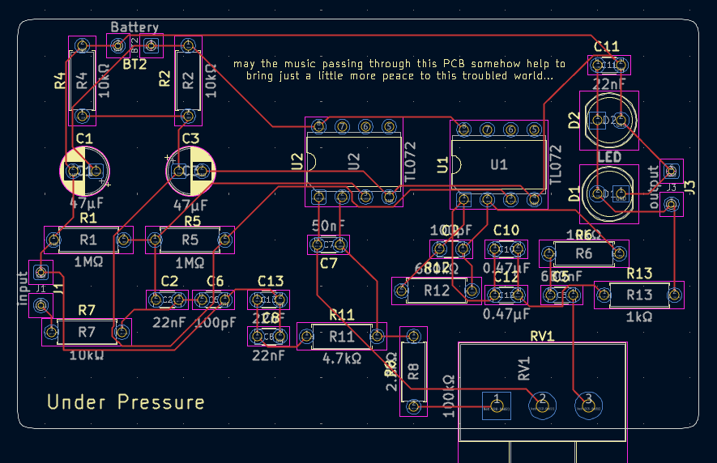
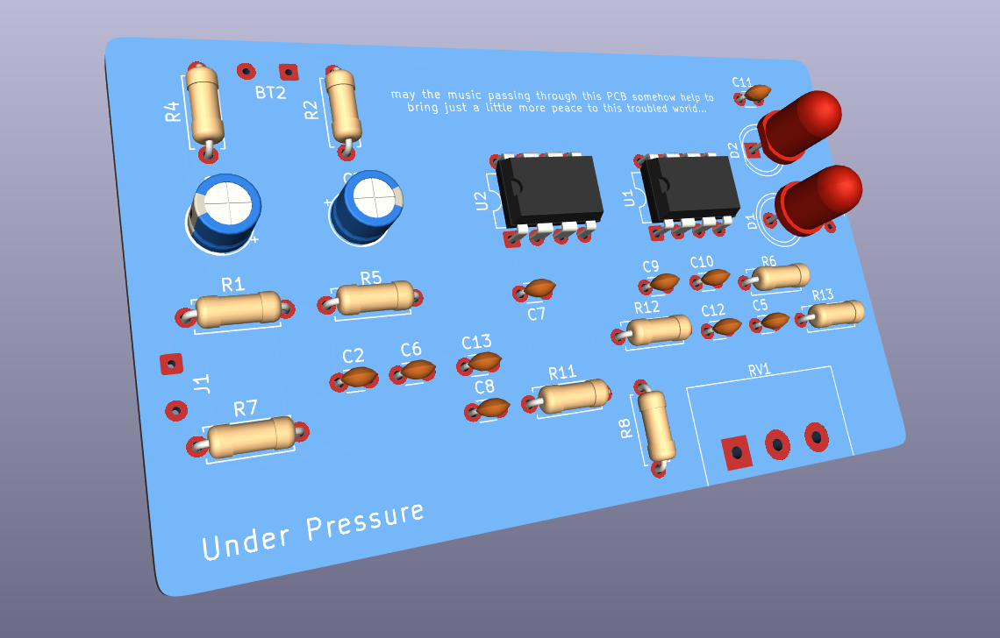

# PCB Design Process in KiCad

This is the workflow I followed to go from breadboard prototype to a finished pedal PCB.

## 1. Create the Schematic in KiCad

1. Open the project in the **Schematic Editor**.
2. Place symbols for all components (op-amp, resistors, capacitors, diodes, jacks, power, etc.).
3. Connect nets with clear labels (`IN`, `OUT`, `GND`, `V+`, etc.).
4. Assign footprints to each symbol using **Tools > Assign Footprints**.
5. Run **ERC (Electrical Rules Check)** and fix important warnings.

Expected result: a clean schematic with no critical errors and all footprints assigned.

> You may notice you cannot find the VCC and GND pins for the TL072 op-amp. If that happens, add another TL072 symbol **with the same reference name** and set it to Unit C. Pins 4 and 8 will appear there. You can see this in the stages schematic.

## 2. Move to the PCB Editor

1. Open the **PCB Editor**.
2. Use **Tools > Update PCB from Schematic** to import the netlist and components.
3. Define the board outline on the `Edge.Cuts` layer.
4. Configure basic design rules: minimum track width, minimum clearance...

## 3. Place Components

1. Place mechanical parts first (jacks, potentiometers, switch, LED, connectors) based on enclosure and ergonomics.
2. Group components by functional blocks (power stage, core, and gain).
3. Keep sensitive signal paths short and separate high-impedance audio nodes where possible.
4. Leave enough room for routing and ground areas.

## 4. Route Traces

1. Route critical lines first (input, feedback, and audio output).
2. Route power and ground after that.
3. Use a ground plane when it helps reduce noise.
4. Avoid unnecessary crossings, very long traces on sensitive nodes, and awkward angles.
5. Run **DRC (Design Rules Check)** to verify everything and fix errors.

Routing example:

## 5. Generate Gerbers and Drill Files

1. In PCB Editor, open **File > Plot**.
2. Generate the required Gerber layers (copper, solder mask, silkscreen, board outline, etc.).
3. Generate drill files with **Generate Drill Files** (`.drl` PTH and NPTH).
4. Verify everything with a Gerber viewer before sending to manufacturing.
5. Save the final fabrication package in the project output folder (for example, `hardware/pcb/gerbers`).

## Rendered View

## 6. Send to Manufacturing

Choose your preferred PCB manufacturer and place the order.